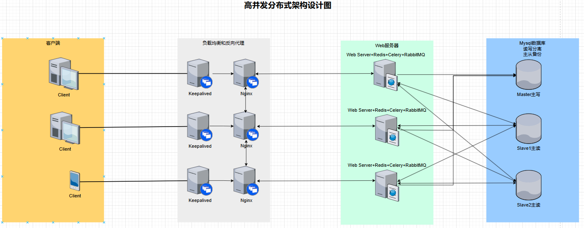

# ShopServer

## 简介
​	这是一个Django分布式商城后端的基础代码，DRF用来进行RestfulAPI接口设计和实现；Celery用来进行任务的调度，由于这里没有前端的支持，仅仅是将Celery来做一个登录和登出的记录，目的是为了做一个使用Celery的示例演示，方便后续自行扩展；Celery的消息中间件使用RabbitMQ来进行转发，结果后端用Redis数据库；Django的缓存也是用的Redis数据库；数据持久化采用的是Mysql数据库，这里就没有做Mysql数据库的读写示例，可以自行添加Mysql的主从备份和读写分离。通过这个基础代码可以快速构建一个高并发的商城后端。

## 软件架构

### 系统架构

​	在这里采用了Keepalived和Nginx来做高可用解决方案，防止单点故障发生；同时还采用了多台服务器节点运行多个后端实例，用Celery来做任务调度，使用RabbitMQ作为Celery的消息中间件，Redis作为Celery的结果后端；并且Redis也是Django的缓存，数据库采用的是Mysql，并且搭建了数据库的主从备份，主负责写操作，从负责读操作，从而保证了数据库的高可用。这套架构便于根据不通的需求进行横向扩展和删减。



### 数据库设计


#### 安装教程

以下环境是在Ubuntu下进行安装，Windows的暂未试过。在Ubuntu中安装软件前先运行以下两条命令，用来更新Ubuntu系统的包管理和已安装的软件包。

```python
sudo apt update
sudo apt upgrade
```

1. Python版本：Python3.9版本及以上，作者最高使用的是Python3.10.12版本。

2. 安装环境：

    在项目中有环境文件requirements.txt文件，通过pip进行安装。

    ```python
    pip3 install -r requeirements.txt
    ```

    如果下载过慢，使用以下带有镜像源的命令。

    ```python
    pip3 install -r requirements.txt -i https://pypi.tuna.tsinghua.edu.cn/simple
    ```

3. 安装Redis

    ```python
    # 安装Redis，项目目录下有Redis、Nginx和Keepalived的基础配置，有需要可以在这配置上添加新的内容，无特殊需要使用这个默认配置即可（Nginx集群的配置需要在Nginx下的backend_servers下自行添加服务器IP和端口即可）。
    sudo apt install redis-server
    # 启动Redis并设置为开机自启
    sudo systemctl start redis-server
    sudo systemctl enable redis-server
    ```

4. 安装RabbitMQ

    ```python
    # 安装RabbitMQ
    sudo apt install rabbitmq-server
    # 启动RabbitMQ并设置为开机自启
    sudo systemctl start rabbitmq-server
    sudo systemctl enable rabbitmq-server
    ```

5. 安装Mysql

    ```python
    # 安装mysql
    sudo apt install mysql-server
    # 启动mysql并设置为开机自启
    sudo systemctl start mysql
    sudo systemctl enable mysql
    # 检查mysql服务的状态
    sudo systemctl status mysql
    ```

    

6. 安装Keepalived

    ```python
    # 安装Nginx
    sudo apt install keepalived
    # 启动Nginx并设置为开机自启
    sudo systemctl start keepalived
    sudo systemctl enable keepalived
    ```

7. 安装Nginx

    ```python
    # 安装Nginx
    sudo apt install nginx
    # 启动Nginx并设置为开机自启
    sudo systemctl start nginx
    sudo systemctl enable nginx
    ```

#### 使用说明

1. 启动Django项目

    ```python
    # 数据库迁移，迁移之前请自行创建好数据库，数据库名称在settings.py文件中，根据自己需求更改
    python3 manage.py makemigrations
    python3 manage.py migrate
    # 启动项目，如果只是本地测试，则用127.0.0.1即可
    python3 manage.py runserver 0.0.0.0 8888
    ```

2. 启动Celery

    ```python
    # 启动celery，myproject是celery.py配置文件中配置的项目名称
    celery -A myproject worker --loglevel=info
    ```

3. 接口测试

    ```python
    # 由于没有前端的支持，可以使用DRF自带的接口访问进行测试
    http://127.0.0.1:8888/api
    ```

#### 参与贡献

1.  Fork 本仓库
2.  新建 Feat_xxx 分支
3.  提交代码
4.  新建 Pull Request


#### 特技

1.  使用 Readme\_XXX.md 来支持不同的语言，例如 Readme\_en.md, Readme\_zh.md
2.  Gitee 官方博客 [blog.gitee.com](https://blog.gitee.com)
3.  你可以 [https://gitee.com/explore](https://gitee.com/explore) 这个地址来了解 Gitee 上的优秀开源项目
4.  [GVP](https://gitee.com/gvp) 全称是 Gitee 最有价值开源项目，是综合评定出的优秀开源项目
5.  Gitee 官方提供的使用手册 [https://gitee.com/help](https://gitee.com/help)
6.  Gitee 封面人物是一档用来展示 Gitee 会员风采的栏目 [https://gitee.com/gitee-stars/](https://gitee.com/gitee-stars/)
